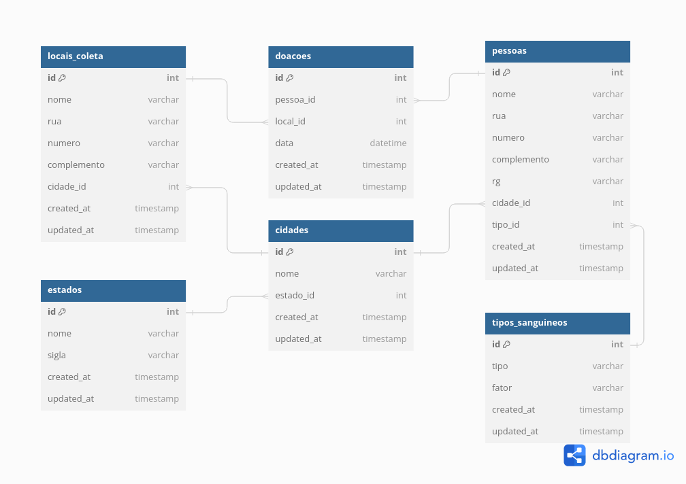

# Sistema de Agendamento de Doação de Sangue


O objetivo deste sistema é controlar o processo de agendamento de doação de sangue numa determina instituição. O diagrama do banco de dados completo é apresentado na [figura abaixo](./database-model/CSI606-sistema-doacao-sangue.png). Você também pode acessar o modelo definido a partir do [DBDiagram](https://dbdiagram.io/d/CSI606-sistema-doacao-sangue-630d077e0911f91ba5ecf743).



## Requirements
>Ter instalado pelo menos um gerenciador de pacotes do Node, [Npm](https://www.npmjs.com/) ou [Yarn](https://yarnpkg.com/).
>Ter instalado banco de dados MongoDB ou utilização do mesmo pelo MongoDB Atlas que permite a utilização online, após o mesmo criar um arquivo <b>.env</b> na pasta backend do projeto com as seguintes informações do banco:
```sh
PORT=<Porta onde o backend irá funcionar, sugestão: 3000>
DB_HOST=<Host do banco de dados para acesso ao mesmo>
```

## Installing
>Executar na raiz do projeto o seguinte comando para instalar as dependências:
```sh
yarn install	   ou		npm install
```

## Use <a  name="usage"></a>
>Executar na raiz do projeto o seguinte comando para iniciar o projeto:
```sh
yarn start	   ou		npm run start
```


## Contributing

> :information_desk_person: O projeto é de livre acesso e uso, então fique à-vontade para realizar um Fork e utilizar do mesmo, como também sugerir dicas e melhorias.

>

> 1. Faça um **fork** do projeto.

> 2. Crie uma nova branch com as suas alterações: `git checkout -b my-feature`

> 3. Salve as alterações e crie uma mensagem de commit contando o que você fez: `git commit -m "feature: My new feature"`

> 4. Envie as suas alterações: `git push origin my-feature`

> Caso tenha alguma dúvida confira este [guia de como contribuir no GitHub](https://github.com/firstcontributions/first-contributions)

## Tech
> :space_invader: Softwares e tecnologias utilizadas para o desenvolvimento e uso do projeto:
>
* [Node.js] - Ferramenta base utilizada para o desenvolvimento geral.
* [SQLite] - Banco de dados utilizado para registro de informações do mesmo.
* [VSCode] - Ótimo editor de texto.
* [StackEdit] - Excelente editor de Markdown online.

[Node.js]: <https://nodejs.org/>
[VSCode]: <https://code.visualstudio.com/>
[StackEdit]: <https://stackedit.io/>
[SQLite]:<https://www.sqlite.org/docs.html>